# E-Voting Platform - Technical Documentation

## Table of Contents
1. [System Overview](#1-system-overview)
2. [Architecture](#2-architecture)
3. [Technology Stack](#3-technology-stack)
4. [Database Design](#4-database-design)
5. [Security Architecture](#5-security-architecture)
6. [Authentication Flows](#6-authentication-flows)
7. [Core Business Flows](#7-core-business-flows)
8. [Component Interactions](#8-component-interactions)
9. [API & Servlet Mapping Reference](#9-api--servlet-mapping-reference)
10. [Deployment Architecture](#10-deployment-architecture)

---

## 1. System Overview

The E-Voting Platform is a secure web-based electronic voting system designed for college elections, society polls, and local body elections. It provides end-to-end digital voting with two-factor authentication, admin-managed voter approval workflows, anonymous ballot casting, and verifiable receipt-based audit trails.

### 1.1 Key Capabilities

| Capability | Description |
|---|---|
| Voter Self-Registration | OTP-verified email-based registration with age 18+ enforcement |
| Admin Approval Workflow | Admin must approve (KYC check) each voter before they can vote |
| Two-Factor Authentication | Password + Email OTP for every voter login |
| One-Person-One-Vote | Enforced at application layer + database unique constraint |
| Anonymous Balloting | Vote is linked to voter_id for eligibility, but receipt token is the only audit trail |
| Receipt-Based Audit | Each vote generates a unique 64-char receipt token for post-election verification |
| Role-Based Access | Voters vote; Admins manage elections, candidates, voters, and results |
| Result Export | CSV and HTML export of election results |

### 1.2 System Context Diagram

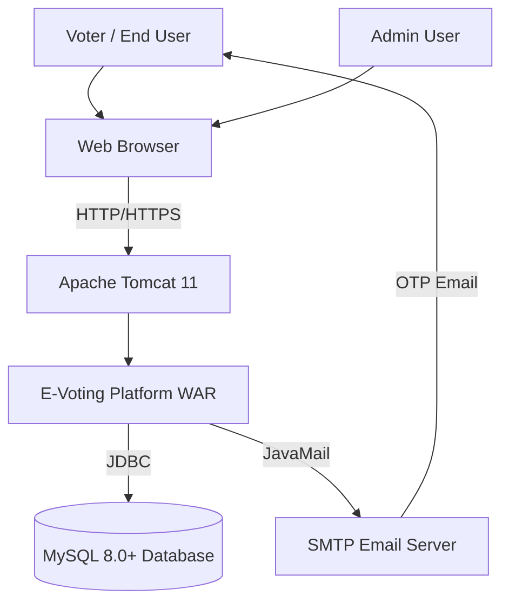
```mermaid
graph TB
    Voter[Voter / End User]
    Admin[Admin User]
    Browser[Web Browser]
    SMTP[SMTP Email Server]
    MySQL[(MySQL 8.0+ Database)]
    Tomcat[Apache Tomcat 11]
    App[E-Voting Platform WAR]

    Voter --> Browser
    Admin --> Browser
    Browser -->|HTTP/HTTPS| Tomcat
    Tomcat --> App
    App -->|JDBC| MySQL
    App -->|JavaMail| SMTP
    SMTP -->|OTP Email| Voter
```

---

## 2. Architecture

### 2.1 High-Level Architecture Diagram

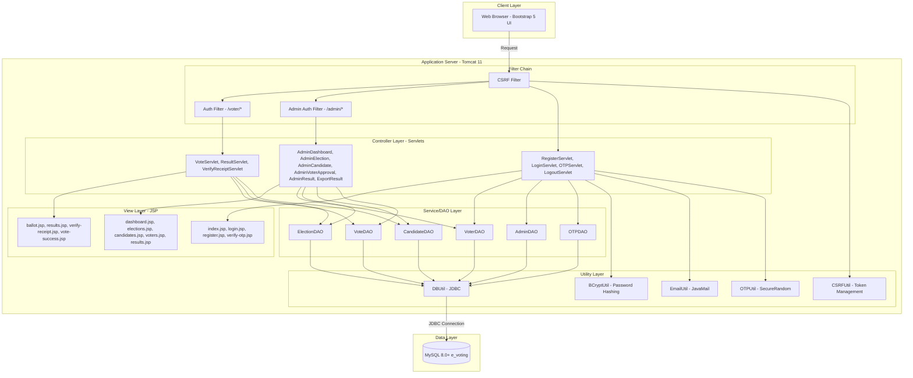
```mermaid
graph TB
    subgraph Client Layer
        Browser[Web Browser - Bootstrap 5 UI]
    end

    subgraph Application Server - Tomcat 11
        subgraph Filter Chain
            CSRFFilter[CSRF Filter]
            AuthFilter[Auth Filter - /voter/*]
            AdminAuthFilter[Admin Auth Filter - /admin/*]
        end

        subgraph Controller Layer - Servlets
            PublicServlets[RegisterServlet, LoginServlet, OTPServlet, LogoutServlet]
            VoterServlets[VoteServlet, ResultServlet, VerifyReceiptServlet]
            AdminServlets[AdminDashboard, AdminElection, AdminCandidate, AdminVoterApproval, AdminResult, ExportResult]
        end

        subgraph Service/DAO Layer
            VoterDAO[VoterDAO]
            AdminDAO[AdminDAO]
            ElectionDAO[ElectionDAO]
            CandidateDAO[CandidateDAO]
            VoteDAO[VoteDAO]
            OTPDAO[OTPDAO]
        end

        subgraph Utility Layer
            DBUtil[DBUtil - JDBC]
            BCryptUtil[BCryptUtil - Password Hashing]
            EmailUtil[EmailUtil - JavaMail]
            OTPUtil[OTPUtil - SecureRandom]
            CSRFUtil[CSRFUtil - Token Management]
        end

        subgraph View Layer - JSP
            PublicJSPs[index.jsp, login.jsp, register.jsp, verify-otp.jsp]
            VoterJSPs[ballot.jsp, results.jsp, verify-receipt.jsp, vote-success.jsp]
            AdminJSPs[dashboard.jsp, elections.jsp, candidates.jsp, voters.jsp, results.jsp]
        end
    end

    subgraph Data Layer
        MySQL[(MySQL 8.0+ e_voting)]
    end

    Browser -->|Request| CSRFFilter
    CSRFFilter --> AuthFilter
    CSRFFilter --> AdminAuthFilter
    CSRFFilter --> PublicServlets
    AuthFilter --> VoterServlets
    AdminAuthFilter --> AdminServlets
    PublicServlets --> PublicJSPs
    VoterServlets --> VoterJSPs
    AdminServlets --> AdminJSPs
    PublicServlets --> VoterDAO
    PublicServlets --> AdminDAO
    PublicServlets --> OTPDAO
    VoterServlets --> VoteDAO
    VoterServlets --> ElectionDAO
    VoterServlets --> CandidateDAO
    AdminServlets --> VoterDAO
    AdminServlets --> ElectionDAO
    AdminServlets --> CandidateDAO
    AdminServlets --> VoteDAO
    VoterDAO --> DBUtil
    AdminDAO --> DBUtil
    ElectionDAO --> DBUtil
    CandidateDAO --> DBUtil
    VoteDAO --> DBUtil
    OTPDAO --> DBUtil
    DBUtil -->|JDBC Connection| MySQL
    PublicServlets --> BCryptUtil
    PublicServlets --> EmailUtil
    PublicServlets --> OTPUtil
    CSRFFilter --> CSRFUtil
```

### 2.2 MVC Pattern Implementation

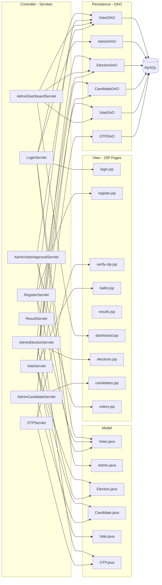
```mermaid
graph LR
    subgraph Model
        M1[Voter.java]
        M2[Admin.java]
        M3[Election.java]
        M4[Candidate.java]
        M5[Vote.java]
        M6[OTP.java]
    end

    subgraph View - JSP Pages
        V1[login.jsp]
        V2[register.jsp]
        V3[verify-otp.jsp]
        V4[ballot.jsp]
        V5[results.jsp]
        V6[dashboard.jsp]
        V7[elections.jsp]
        V8[candidates.jsp]
        V9[voters.jsp]
    end

    subgraph Controller - Servlets
        C1[LoginServlet]
        C2[RegisterServlet]
        C3[OTPServlet]
        C4[VoteServlet]
        C5[ResultServlet]
        C6[AdminDashboardServlet]
        C7[AdminElectionServlet]
        C8[AdminCandidateServlet]
        C9[AdminVoterApprovalServlet]
    end

    subgraph Persistence - DAO
        D1[VoterDAO]
        D2[AdminDAO]
        D3[ElectionDAO]
        D4[CandidateDAO]
        D5[VoteDAO]
        D6[OTPDAO]
    end

    C1 --> M1
    C1 --> M2
    C1 --> V1
    C1 --> D1
    C1 --> D2
    C2 --> M1
    C2 --> M6
    C2 --> V2
    C2 --> D1
    C3 --> M6
    C3 --> V3
    C3 --> D6
    C4 --> M3
    C4 --> M4
    C4 --> M5
    C4 --> V4
    C4 --> D3
    C4 --> D4
    C4 --> D5
    C6 --> V6
    C6 --> D1
    C6 --> D3
    C6 --> D5
    C7 --> M3
    C7 --> V7
    C7 --> D3
    C8 --> M4
    C8 --> V8
    C8 --> D4
    C9 --> M1
    C9 --> V9
    C9 --> D1
    D1 --> DB[(MySQL)]
    D2 --> DB
    D3 --> DB
    D4 --> DB
    D5 --> DB
    D6 --> DB
```

**Request Flow (MVC):**
1. **Browser** sends HTTP request
2. **CSRFFilter** validates CSRF token on POST, sets security headers
3. **AuthFilter / AdminAuthFilter** checks session for authenticated user
4. **Servlet (Controller)** processes request, calls DAO, sets request attributes
5. **DAO** executes parameterized SQL queries against MySQL
6. **JSP (View)** renders model data using JSTL / EL expressions
7. **Response** sent back to browser with Bootstrap 5 rendered HTML

---

## 3. Technology Stack

| Layer | Technology | Version | Purpose |
|---|---|---|---|
| Language | Java | 17 | Core language |
| Backend Framework | Jakarta Servlets | 6.0 | Controller layer |
| View Technology | JSP + JSTL | 3.1 / 3.0 | Server-side rendering |
| UI Framework | Bootstrap 5 | 5.3.2 | Responsive frontend |
| Database | MySQL | 8.0+ | Persistent storage |
| Application Server | Apache Tomcat | 11.0.22 | Servlet container |
| Build Tool | Maven | 3.x | Build automation |
| Password Hashing | jBCrypt | 0.4 | BCrypt cost-factor 12 |
| Email | Jakarta Mail | 2.0.1 | SMTP OTP delivery |
| DB Connector | MySQL Connector/J | 8.2.0 | JDBC driver |
| JSON | Gson | 2.10.1 | AJAX response payloads |
| File Upload | Commons FileUpload | 1.5 | Candidate photo uploads |
| CSV Export | OpenCSV | 5.9 | Result export |
| Icons | Bootstrap Icons | 1.11.3 | UI iconography |

### 3.1 Package Structure

```
com.evoting
├── dao/                    Data Access Objects
│   ├── AdminDAO.java
│   ├── CandidateDAO.java
│   ├── ElectionDAO.java
│   ├── OTPDAO.java
│   ├── VoteDAO.java
│   └── VoterDAO.java
├── filter/                 Servlet Filters
│   ├── AdminAuthFilter.java
│   ├── AuthFilter.java
│   └── CSRFFilter.java
├── model/                  Entity/POJO Classes
│   ├── Admin.java
│   ├── Candidate.java
│   ├── Election.java
│   ├── OTP.java
│   ├── Vote.java
│   └── Voter.java
├── servlet/                Controller Servlets
│   ├── AdminCandidateServlet.java
│   ├── AdminDashboardServlet.java
│   ├── AdminElectionServlet.java
│   ├── AdminResultServlet.java
│   ├── AdminVoterApprovalServlet.java
│   ├── ExportResultServlet.java
│   ├── LoginServlet.java
│   ├── LogoutServlet.java
│   ├── OTPServlet.java
│   ├── RegisterServlet.java
│   ├── ResultServlet.java
│   ├── VerifyReceiptServlet.java
│   └── VoteServlet.java
└── util/                   Utility Classes
    ├── BCryptUtil.java
    ├── CSRFUtil.java
    ├── DBUtil.java
    ├── EmailUtil.java
    └── OTPUtil.java
```

---

## 4. Database Design

### 4.1 Entity-Relationship Diagram

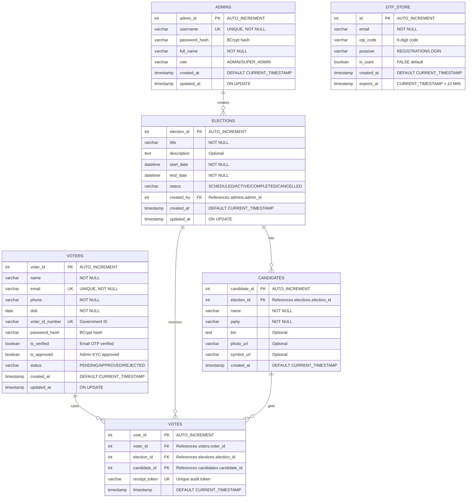
```mermaid
erDiagram
    ADMINS {
        int admin_id PK "AUTO_INCREMENT"
        varchar username UK "UNIQUE, NOT NULL"
        varchar password_hash "BCrypt hash"
        varchar full_name "NOT NULL"
        varchar role "ADMIN/SUPER_ADMIN"
        timestamp created_at "DEFAULT CURRENT_TIMESTAMP"
        timestamp updated_at "ON UPDATE"
    }

    VOTERS {
        int voter_id PK "AUTO_INCREMENT"
        varchar name "NOT NULL"
        varchar email UK "UNIQUE, NOT NULL"
        varchar phone "NOT NULL"
        date dob "NOT NULL"
        varchar voter_id_number UK "Government ID"
        varchar password_hash "BCrypt hash"
        boolean is_verified "Email OTP verified"
        boolean is_approved "Admin KYC approved"
        varchar status "PENDING/APPROVED/REJECTED"
        timestamp created_at "DEFAULT CURRENT_TIMESTAMP"
        timestamp updated_at "ON UPDATE"
    }

    ELECTIONS {
        int election_id PK "AUTO_INCREMENT"
        varchar title "NOT NULL"
        text description "Optional"
        datetime start_date "NOT NULL"
        datetime end_date "NOT NULL"
        varchar status "SCHEDULED/ACTIVE/COMPLETED/CANCELLED"
        int created_by FK "References admins.admin_id"
        timestamp created_at "DEFAULT CURRENT_TIMESTAMP"
        timestamp updated_at "ON UPDATE"
    }

    CANDIDATES {
        int candidate_id PK "AUTO_INCREMENT"
        int election_id FK "References elections.election_id"
        varchar name "NOT NULL"
        varchar party "NOT NULL"
        text bio "Optional"
        varchar photo_url "Optional"
        varchar symbol_url "Optional"
        timestamp created_at "DEFAULT CURRENT_TIMESTAMP"
    }

    VOTES {
        int vote_id PK "AUTO_INCREMENT"
        int voter_id FK "References voters.voter_id"
        int election_id FK "References elections.election_id"
        int candidate_id FK "References candidates.candidate_id"
        varchar receipt_token UK "Unique audit token"
        timestamp timestamp "DEFAULT CURRENT_TIMESTAMP"
    }

    OTP_STORE {
        int id PK "AUTO_INCREMENT"
        varchar email "NOT NULL"
        varchar otp_code "6-digit code"
        varchar purpose "REGISTRATION/LOGIN"
        boolean is_used "FALSE default"
        timestamp created_at "DEFAULT CURRENT_TIMESTAMP"
        timestamp expires_at "CURRENT_TIMESTAMP + 10 MIN"
    }

    ADMINS ||--o{ ELECTIONS : "creates"
    ELECTIONS ||--o{ CANDIDATES : "has"
    VOTERS ||--o{ VOTES : "casts"
    ELECTIONS ||--o{ VOTES : "receives"
    CANDIDATES ||--o{ VOTES : "gets"
```

### 4.2 Table Relationships & Constraints

| Constraint | Table | Description |
|---|---|---|
| `UNIQUE (voter_id, election_id)` | votes | **Prevents double-voting** at DB level |
| `UNIQUE receipt_token` | votes | Ensures unique audit trail tokens |
| `UNIQUE email` | voters | One account per email |
| `UNIQUE voter_id_number` | voters | One account per government ID |
| `UNIQUE username` | admins | Unique admin usernames |
| `FK elections.created_by` | elections -> admins | Track who created each election |
| `FK candidates.election_id` | candidates -> elections | ON DELETE CASCADE |
| `FK votes.voter_id` | votes -> voters | ON DELETE RESTRICT |
| `FK votes.election_id` | votes -> elections | ON DELETE RESTRICT |
| `FK votes.candidate_id` | votes -> candidates | ON DELETE RESTRICT |

### 4.3 Indexes for Performance

| Index | Table | Columns | Purpose |
|---|---|---|---|
| `idx_voters_email` | voters | email | Fast email lookup during login |
| `idx_elections_status` | elections | status | Filter active/completed elections |
| `idx_candidates_election` | candidates | election_id | Load candidates per election |
| `idx_votes_election` | votes | election_id | Aggregate results per election |
| `idx_otp_email` | otp_store | email, is_used, created_at | OTP lookup during verification |

### 4.4 Sample Data

The schema seeds a default admin account:

| Field | Value |
|---|---|
| username | `admin` |
| password | `admin123` (stored as BCrypt hash) |
| full_name | System Administrator |
| role | SUPER_ADMIN |

---

## 5. Security Architecture

### 5.1 Security Layers Diagram

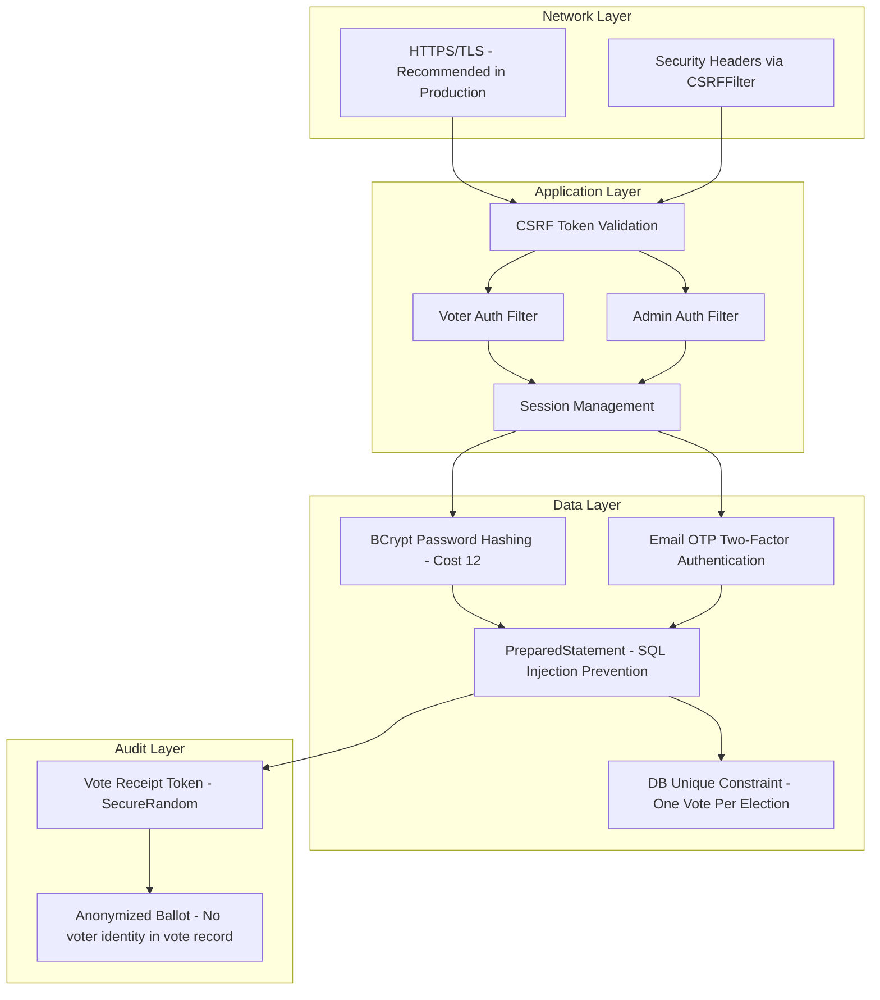
```mermaid
graph TB
    subgraph Network Layer
        HTTPS[HTTPS/TLS - Recommended in Production]
        HSTS[Security Headers via CSRFFilter]
    end

    subgraph Application Layer
        CSRF[CSRF Token Validation]
        Auth[Voter Auth Filter]
        AdminAuth[Admin Auth Filter]
        Session[Session Management]
    end

    subgraph Data Layer
        BCrypt[BCrypt Password Hashing - Cost 12]
        PreparedStmt[PreparedStatement - SQL Injection Prevention]
        UniqueConstraint[DB Unique Constraint - One Vote Per Election]
        OTP2FA[Email OTP Two-Factor Authentication]
    end

    subgraph Audit Layer
        ReceiptToken[Vote Receipt Token - SecureRandom]
        VoteAnonymity[Anonymized Ballot - No voter identity in vote record]
    end

    HTTPS --> CSRF
    HSTS --> CSRF
    CSRF --> Auth
    CSRF --> AdminAuth
    Auth --> Session
    AdminAuth --> Session
    Session --> BCrypt
    Session --> OTP2FA
    BCrypt --> PreparedStmt
    OTP2FA --> PreparedStmt
    PreparedStmt --> UniqueConstraint
    PreparedStmt --> ReceiptToken
    ReceiptToken --> VoteAnonymity
```

### 5.2 Security Features Matrix

| Threat | Mitigation | Implementation |
|---|---|---|
| **SQL Injection** | PreparedStatement for all queries | All 6 DAO classes use parameterized queries |
| **Cross-Site Request Forgery** | Per-session CSRF tokens | `CSRFFilter` validates `_csrf` param on POST; `CSRFUtil` generates Base64 tokens via `SecureRandom` |
| **Password Theft** | BCrypt hashing (cost 12) | `BCryptUtil.hashPassword()` / `checkPassword()` |
| **Credential Stuffing** | Two-factor authentication | Email OTP required after password verification |
| **Session Hijacking** | HttpOnly session cookies | `web.xml` cookie-config `<http-only>true</http-only>` |
| **Clickjacking** | X-Frame-Options: DENY | Set by `CSRFFilter` on every response |
| **MIME Sniffing** | X-Content-Type-Options: nosniff | Set by `CSRFFilter` |
| **XSS** | X-XSS-Protection: 1; mode=block | Set by `CSRFFilter`; JSTL auto-escapes output |
| **Double Voting** | App check + DB unique constraint | `VoteDAO.hasVoted()` check + `UNIQUE(voter_id, election_id)` constraint |
| **Cache Poisoning** | Cache-Control: no-cache, no-store | Set by `CSRFFilter` |
| **Unauthorized Access** | Servlet Filters | `AuthFilter` for `/voter/*`, `AdminAuthFilter` for `/admin/*` |
| **Session Timeout** | 30-minute inactivity timeout | `web.xml` `<session-timeout>30</session-timeout>` |
| **Vote Tampering** | Receipt token audit trail | `OTPUtil.generateReceiptToken()` via `SecureRandom` |

### 5.3 CSRF Protection Flow

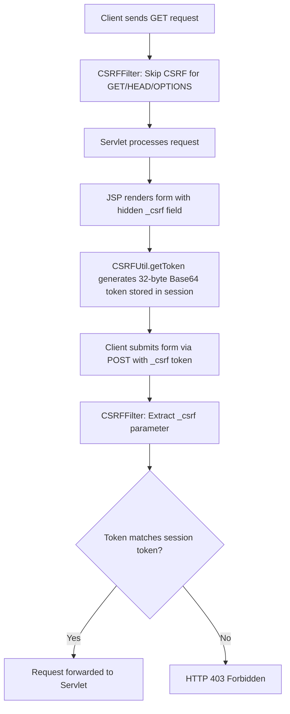
```mermaid
graph TB
    A[Client sends GET request] --> B[CSRFFilter: Skip CSRF for GET/HEAD/OPTIONS]
    B --> C[Servlet processes request]
    C --> D[JSP renders form with hidden _csrf field]
    D --> E[CSRFUtil.getToken generates 32-byte Base64 token stored in session]
    E --> F[Client submits form via POST with _csrf token]
    F --> G[CSRFFilter: Extract _csrf parameter]
    G --> H{Token matches session token?}
    H -->|Yes| I[Request forwarded to Servlet]
    H -->|No| J[HTTP 403 Forbidden]
```

### 5.4 Response Security Headers

Every HTTP response includes these headers (set by `CSRFFilter`):

```
X-Content-Type-Options: nosniff
X-Frame-Options: DENY
X-XSS-Protection: 1; mode=block
Cache-Control: no-cache, no-store, must-revalidate
Pragma: no-cache
```

---

## 6. Authentication Flows

### 6.1 Voter Registration + OTP Verification Flow

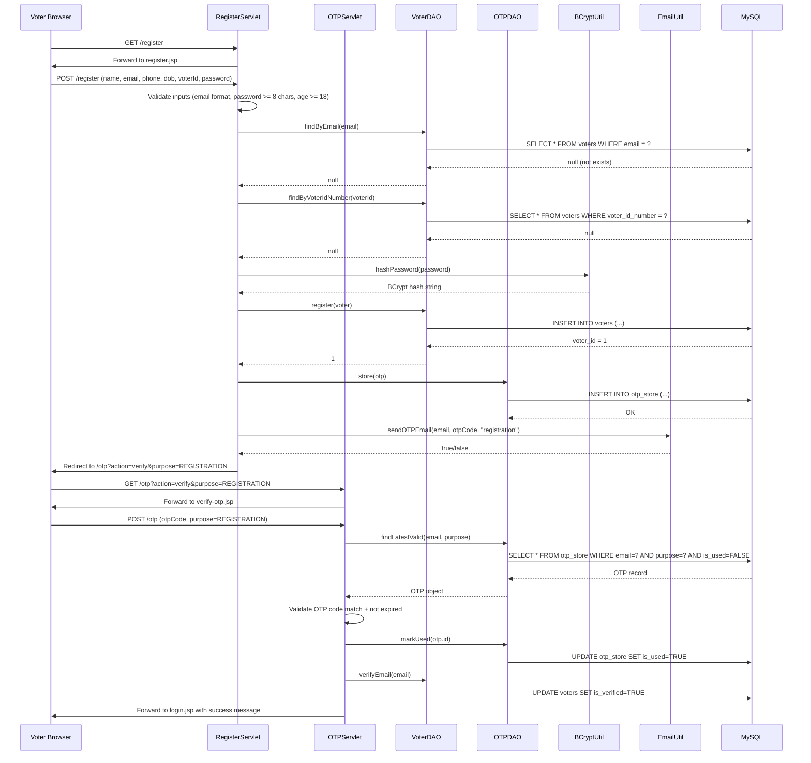
```mermaid
sequenceDiagram
    participant V as Voter Browser
    participant RS as RegisterServlet
    participant OS as OTPServlet
    participant VDAO as VoterDAO
    participant ODAO as OTPDAO
    participant BC as BCryptUtil
    participant EM as EmailUtil
    participant DB as MySQL

    V->>RS: GET /register
    RS->>V: Forward to register.jsp

    V->>RS: POST /register (name, email, phone, dob, voterId, password)
    RS->>RS: Validate inputs (email format, password >= 8 chars, age >= 18)
    RS->>VDAO: findByEmail(email)
    VDAO->>DB: SELECT * FROM voters WHERE email = ?
    DB-->>VDAO: null (not exists)
    VDAO-->>RS: null

    RS->>VDAO: findByVoterIdNumber(voterId)
    VDAO->>DB: SELECT * FROM voters WHERE voter_id_number = ?
    DB-->>VDAO: null
    VDAO-->>RS: null

    RS->>BC: hashPassword(password)
    BC-->>RS: BCrypt hash string
    RS->>VDAO: register(voter)
    VDAO->>DB: INSERT INTO voters (...)
    DB-->>VDAO: voter_id = 1
    VDAO-->>RS: 1

    RS->>ODAO: store(otp)
    ODAO->>DB: INSERT INTO otp_store (...)
    DB-->>ODAO: OK

    RS->>EM: sendOTPEmail(email, otpCode, "registration")
    EM-->>RS: true/false

    RS->>V: Redirect to /otp?action=verify&purpose=REGISTRATION

    V->>OS: GET /otp?action=verify&purpose=REGISTRATION
    OS->>V: Forward to verify-otp.jsp

    V->>OS: POST /otp (otpCode, purpose=REGISTRATION)
    OS->>ODAO: findLatestValid(email, purpose)
    ODAO->>DB: SELECT * FROM otp_store WHERE email=? AND purpose=? AND is_used=FALSE
    DB-->>ODAO: OTP record
    ODAO-->>OS: OTP object

    OS->>OS: Validate OTP code match + not expired
    OS->>ODAO: markUsed(otp.id)
    ODAO->>DB: UPDATE otp_store SET is_used=TRUE

    OS->>VDAO: verifyEmail(email)
    VDAO->>DB: UPDATE voters SET is_verified=TRUE

    OS->>V: Forward to login.jsp with success message
```

### 6.2 Voter Login Flow (Password + OTP 2FA)

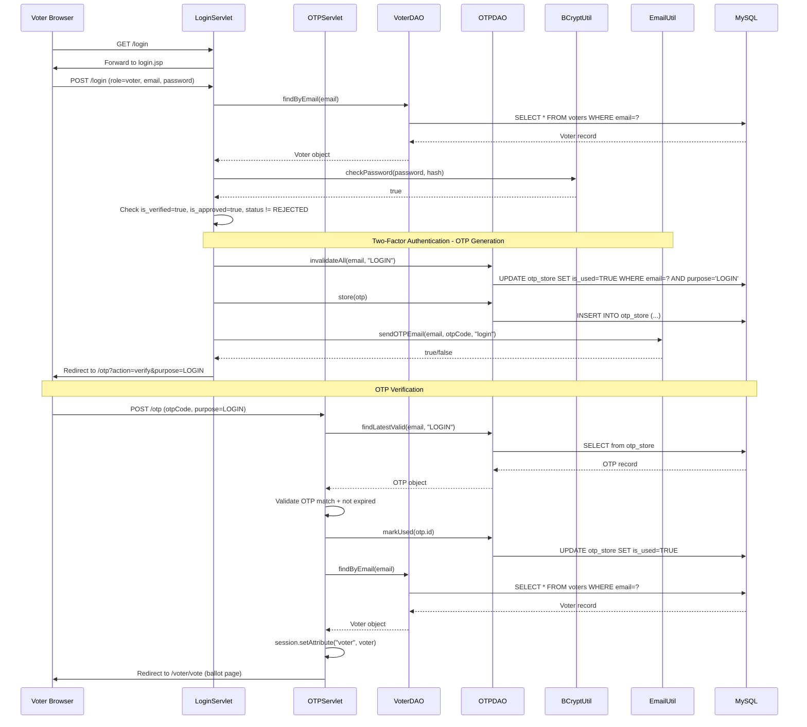
```mermaid
sequenceDiagram
    participant V as Voter Browser
    participant LS as LoginServlet
    participant OS as OTPServlet
    participant VDAO as VoterDAO
    participant ODAO as OTPDAO
    participant BC as BCryptUtil
    participant EM as EmailUtil
    participant DB as MySQL

    V->>LS: GET /login
    LS->>V: Forward to login.jsp

    V->>LS: POST /login (role=voter, email, password)
    LS->>VDAO: findByEmail(email)
    VDAO->>DB: SELECT * FROM voters WHERE email=?
    DB-->>VDAO: Voter record
    VDAO-->>LS: Voter object

    LS->>BC: checkPassword(password, hash)
    BC-->>LS: true

    LS->>LS: Check is_verified=true, is_approved=true, status != REJECTED

    Note over LS,EM: Two-Factor Authentication - OTP Generation

    LS->>ODAO: invalidateAll(email, "LOGIN")
    ODAO->>DB: UPDATE otp_store SET is_used=TRUE WHERE email=? AND purpose='LOGIN'
    LS->>ODAO: store(otp)
    ODAO->>DB: INSERT INTO otp_store (...)
    LS->>EM: sendOTPEmail(email, otpCode, "login")
    EM-->>LS: true/false

    LS->>V: Redirect to /otp?action=verify&purpose=LOGIN

    Note over V,DB: OTP Verification

    V->>OS: POST /otp (otpCode, purpose=LOGIN)
    OS->>ODAO: findLatestValid(email, "LOGIN")
    ODAO->>DB: SELECT from otp_store
    DB-->>ODAO: OTP record
    ODAO-->>OS: OTP object

    OS->>OS: Validate OTP match + not expired
    OS->>ODAO: markUsed(otp.id)
    ODAO->>DB: UPDATE otp_store SET is_used=TRUE

    OS->>VDAO: findByEmail(email)
    VDAO->>DB: SELECT * FROM voters WHERE email=?
    DB-->>VDAO: Voter record
    VDAO-->>OS: Voter object

    OS->>OS: session.setAttribute("voter", voter)
    OS->>V: Redirect to /voter/vote (ballot page)
```

### 6.3 Admin Login Flow

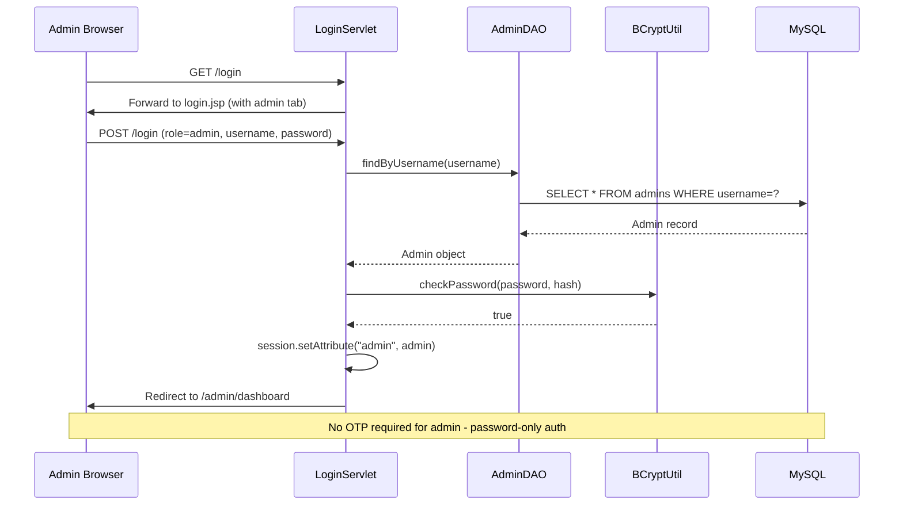
```mermaid
sequenceDiagram
    participant A as Admin Browser
    participant LS as LoginServlet
    participant ADAO as AdminDAO
    participant BC as BCryptUtil
    participant DB as MySQL

    A->>LS: GET /login
    LS->>A: Forward to login.jsp (with admin tab)

    A->>LS: POST /login (role=admin, username, password)
    LS->>ADAO: findByUsername(username)
    ADAO->>DB: SELECT * FROM admins WHERE username=?
    DB-->>ADAO: Admin record
    ADAO-->>LS: Admin object

    LS->>BC: checkPassword(password, hash)
    BC-->>LS: true

    LS->>LS: session.setAttribute("admin", admin)
    LS->>A: Redirect to /admin/dashboard

    Note over A,DB: No OTP required for admin - password-only auth
```

### 6.4 Filter Chain Execution Order

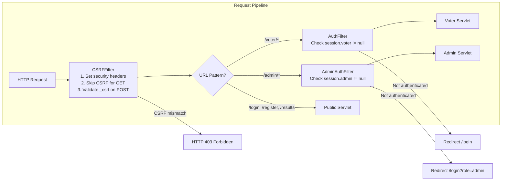
```mermaid
graph LR
    subgraph Request Pipeline
        R[HTTP Request] --> F1
        F1[CSRFFilter<br/>1. Set security headers<br/>2. Skip CSRF for GET<br/>3. Validate _csrf on POST] --> F2
        F2{URL Pattern?} -->|/voter/*| F3
        F2 -->|/admin/*| F4
        F2 -->|/login, /register, /results| S1
        F3[AuthFilter<br/>Check session.voter != null] --> S2
        F4[AdminAuthFilter<br/>Check session.admin != null] --> S3
        S1[Public Servlet]
        S2[Voter Servlet]
        S3[Admin Servlet]
    end

    F3 -->|Not authenticated| REDIR1[Redirect /login]
    F4 -->|Not authenticated| REDIR2[Redirect /login?role=admin]
    F1 -->|CSRF mismatch| ERR[HTTP 403 Forbidden]
```

---

## 7. Core Business Flows

### 7.1 Voting Process (End-to-End)

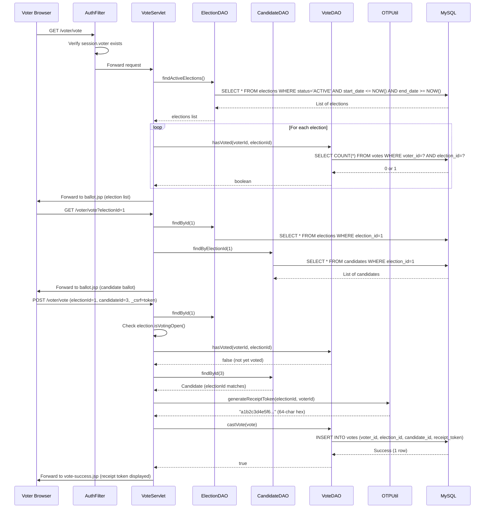
```mermaid
sequenceDiagram
    participant V as Voter Browser
    participant AF as AuthFilter
    participant VS as VoteServlet
    participant EDAO as ElectionDAO
    participant CDAO as CandidateDAO
    participant VDAO as VoteDAO
    participant OT as OTPUtil
    participant DB as MySQL

    V->>AF: GET /voter/vote
    AF->>AF: Verify session.voter exists
    AF->>VS: Forward request

    VS->>EDAO: findActiveElections()
    EDAO->>DB: SELECT * FROM elections WHERE status='ACTIVE' AND start_date <= NOW() AND end_date >= NOW()
    DB-->>EDAO: List of elections
    EDAO-->>VS: elections list

    loop For each election
        VS->>VDAO: hasVoted(voterId, electionId)
        VDAO->>DB: SELECT COUNT(*) FROM votes WHERE voter_id=? AND election_id=?
        DB-->>VDAO: 0 or 1
        VDAO-->>VS: boolean
    end

    VS->>V: Forward to ballot.jsp (election list)

    V->>VS: GET /voter/vote?electionId=1
    VS->>EDAO: findById(1)
    EDAO->>DB: SELECT * FROM elections WHERE election_id=1
    VS->>CDAO: findByElectionId(1)
    CDAO->>DB: SELECT * FROM candidates WHERE election_id=1
    DB-->>CDAO: List of candidates
    VS->>V: Forward to ballot.jsp (candidate ballot)

    V->>VS: POST /voter/vote (electionId=1, candidateId=3, _csrf=token)

    VS->>EDAO: findById(1)
    VS->>VS: Check election.isVotingOpen()

    VS->>VDAO: hasVoted(voterId, electionId)
    VDAO-->>VS: false (not yet voted)

    VS->>CDAO: findById(3)
    CDAO-->>VS: Candidate (electionId matches)

    VS->>OT: generateReceiptToken(electionId, voterId)
    OT-->>VS: "a1b2c3d4e5f6..." (64-char hex)

    VS->>VDAO: castVote(vote)
    VDAO->>DB: INSERT INTO votes (voter_id, election_id, candidate_id, receipt_token)
    DB-->>VDAO: Success (1 row)
    VDAO-->>VS: true

    VS->>V: Forward to vote-success.jsp (receipt token displayed)
```

### 7.2 Double-Vote Prevention (Two Layers)

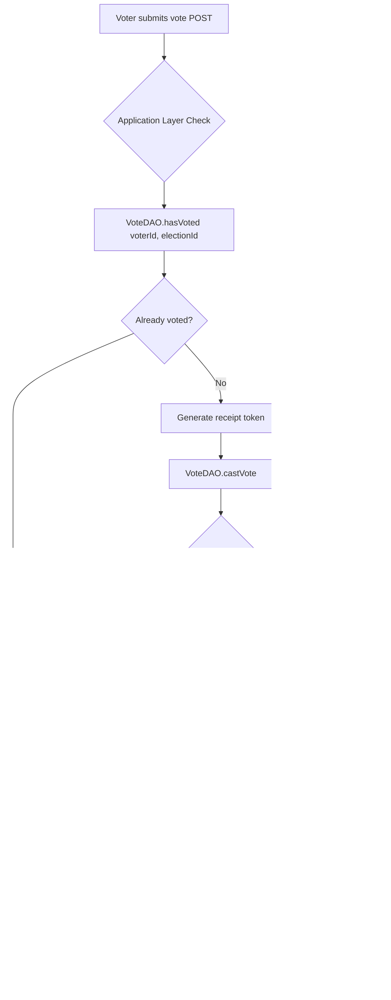
```mermaid
graph TB
    A[Voter submits vote POST] --> B{Application Layer Check}
    B --> C[VoteDAO.hasVoted voterId, electionId]
    C --> D{Already voted?}
    D -->|Yes| E[Show error: Already voted]
    D -->|No| F[Generate receipt token]
    F --> G[VoteDAO.castVote]
    G --> H{Database Layer Check}
    H --> I[UNIQUE constraint voter_id + election_id]
    I --> J{Constraint violation?}
    J -->|Yes| K[Catch SQLIntegrityConstraintViolationException]
    K --> E
    J -->|No| L[Vote recorded successfully]
    L --> M[Show receipt token]
```

### 7.3 Result Computation & Declaration Flow

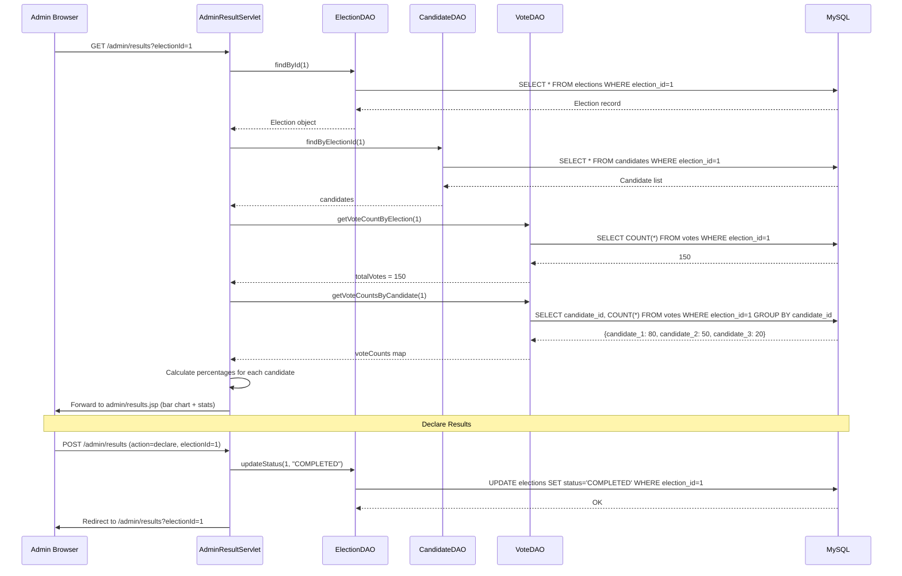
```mermaid
sequenceDiagram
    participant A as Admin Browser
    participant ARS as AdminResultServlet
    participant EDAO as ElectionDAO
    participant CDAO as CandidateDAO
    participant VDAO as VoteDAO
    participant DB as MySQL

    A->>ARS: GET /admin/results?electionId=1

    ARS->>EDAO: findById(1)
    EDAO->>DB: SELECT * FROM elections WHERE election_id=1
    DB-->>EDAO: Election record
    EDAO-->>ARS: Election object

    ARS->>CDAO: findByElectionId(1)
    CDAO->>DB: SELECT * FROM candidates WHERE election_id=1
    DB-->>CDAO: Candidate list
    CDAO-->>ARS: candidates

    ARS->>VDAO: getVoteCountByElection(1)
    VDAO->>DB: SELECT COUNT(*) FROM votes WHERE election_id=1
    DB-->>VDAO: 150
    VDAO-->>ARS: totalVotes = 150

    ARS->>VDAO: getVoteCountsByCandidate(1)
    VDAO->>DB: SELECT candidate_id, COUNT(*) FROM votes WHERE election_id=1 GROUP BY candidate_id
    DB-->>VDAO: {candidate_1: 80, candidate_2: 50, candidate_3: 20}
    VDAO-->>ARS: voteCounts map

    ARS->>ARS: Calculate percentages for each candidate
    ARS->>A: Forward to admin/results.jsp (bar chart + stats)

    Note over A,DB: Declare Results

    A->>ARS: POST /admin/results (action=declare, electionId=1)
    ARS->>EDAO: updateStatus(1, "COMPLETED")
    EDAO->>DB: UPDATE elections SET status='COMPLETED' WHERE election_id=1
    DB-->>EDAO: OK
    ARS->>A: Redirect to /admin/results?electionId=1
```

### 7.4 Admin Voter Approval Workflow

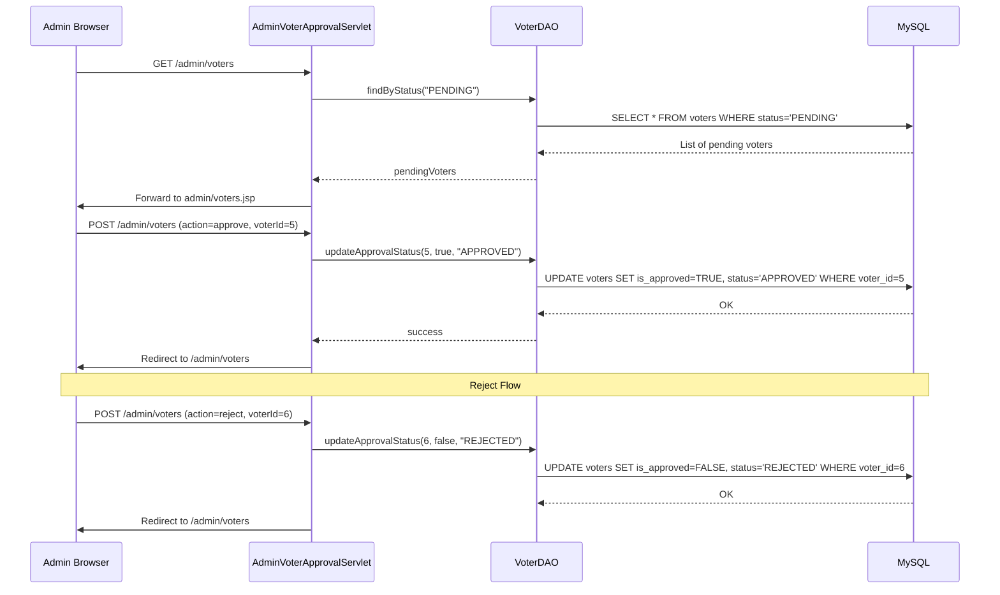
```mermaid
sequenceDiagram
    participant A as Admin Browser
    participant AVAS as AdminVoterApprovalServlet
    participant VDAO as VoterDAO
    participant DB as MySQL

    A->>AVAS: GET /admin/voters

    AVAS->>VDAO: findByStatus("PENDING")
    VDAO->>DB: SELECT * FROM voters WHERE status='PENDING'
    DB-->>VDAO: List of pending voters
    VDAO-->>AVAS: pendingVoters

    AVAS->>A: Forward to admin/voters.jsp

    A->>AVAS: POST /admin/voters (action=approve, voterId=5)

    AVAS->>VDAO: updateApprovalStatus(5, true, "APPROVED")
    VDAO->>DB: UPDATE voters SET is_approved=TRUE, status='APPROVED' WHERE voter_id=5
    DB-->>VDAO: OK
    VDAO-->>AVAS: success

    AVAS->>A: Redirect to /admin/voters

    Note over A,DB: Reject Flow

    A->>AVAS: POST /admin/voters (action=reject, voterId=6)
    AVAS->>VDAO: updateApprovalStatus(6, false, "REJECTED")
    VDAO->>DB: UPDATE voters SET is_approved=FALSE, status='REJECTED' WHERE voter_id=6
    DB-->>VDAO: OK
    AVAS->>A: Redirect to /admin/voters
```

### 7.5 Receipt Verification Flow

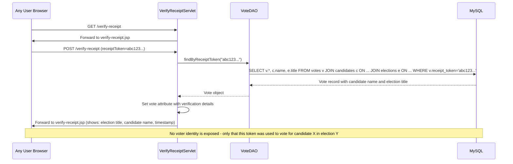
```mermaid
sequenceDiagram
    participant U as Any User Browser
    participant VRS as VerifyReceiptServlet
    participant VDAO as VoteDAO
    participant DB as MySQL

    U->>VRS: GET /verify-receipt
    VRS->>U: Forward to verify-receipt.jsp

    U->>VRS: POST /verify-receipt (receiptToken=abc123...)

    VRS->>VDAO: findByReceiptToken("abc123...")
    VDAO->>DB: SELECT v.*, c.name, e.title FROM votes v JOIN candidates c ON ... JOIN elections e ON ... WHERE v.receipt_token='abc123...'
    DB-->>VDAO: Vote record with candidate name and election title
    VDAO-->>VRS: Vote object

    VRS->>VRS: Set vote attribute with verification details
    VRS->>U: Forward to verify-receipt.jsp (shows: election title, candidate name, timestamp)

    Note over U,DB: No voter identity is exposed - only that this token was used to vote for candidate X in election Y
```

---

## 8. Component Interactions

### 8.1 Servlet to DAO to Database Mapping


```mermaid
graph TB
    subgraph Public Servlets
        RS[RegisterServlet]
        LS[LoginServlet]
        OS[OTPServlet]
        LOS[LogoutServlet]
        RES[ResultServlet]
        VRS[VerifyReceiptServlet]
    end

    subgraph Voter Servlets
        VS[VoteServlet]
    end

    subgraph Admin Servlets
        ADS[AdminDashboardServlet]
        AES[AdminElectionServlet]
        ACS[AdminCandidateServlet]
        AVAS[AdminVoterApprovalServlet]
        ARS[AdminResultServlet]
        ERS[ExportResultServlet]
    end

    subgraph DAO Layer
        VDAO[VoterDAO]
        ADAO[AdminDAO]
        EDAO[ElectionDAO]
        CDAO[CandidateDAO]
        VtDAO[VoteDAO]
        ODAO[OTPDAO]
    end

    RS --> VDAO
    RS --> ODAO
    LS --> VDAO
    LS --> ADAO
    OS --> ODAO
    OS --> VDAO
    RES --> EDAO
    RES --> CDAO
    RES --> VtDAO
    VRS --> VtDAO

    VS --> EDAO
    VS --> CDAO
    VS --> VtDAO

    ADS --> VDAO
    ADS --> EDAO
    ADS --> CDAO
    ADS --> VtDAO
    AES --> EDAO
    ACS --> CDAO
    AVAS --> VDAO
    ARS --> EDAO
    ARS --> CDAO
    ARS --> VtDAO
    ERS --> EDAO
    ERS --> CDAO
    ERS --> VtDAO

    VDAO --> DB[(MySQL e_voting)]
    ADAO --> DB
    EDAO --> DB
    CDAO --> DB
    VtDAO --> DB
    ODAO --> DB
```

### 8.2 Utility Class Dependencies

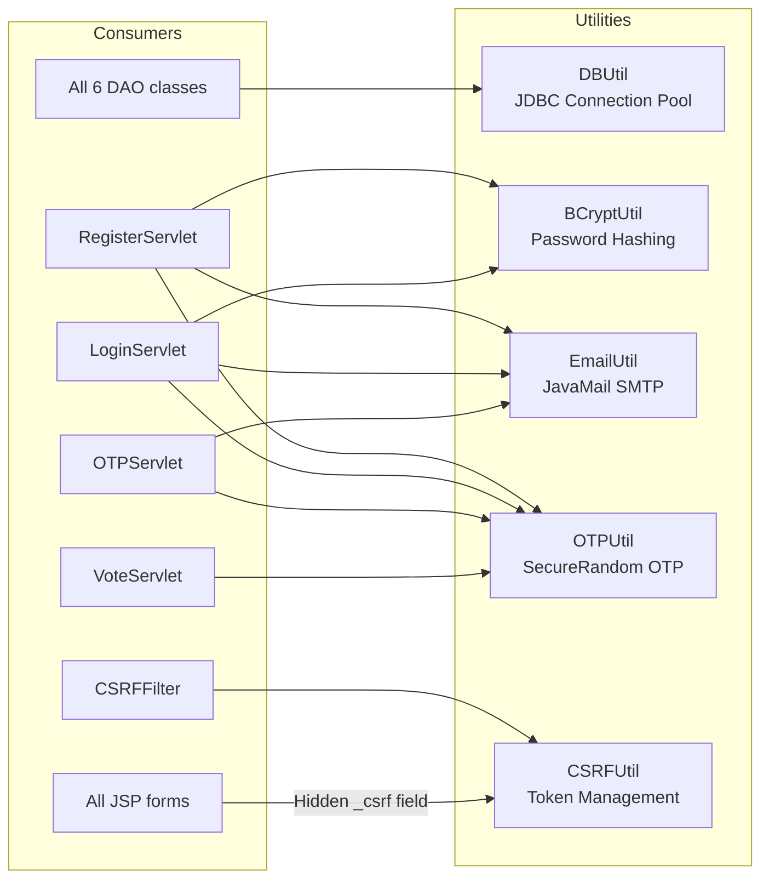
```mermaid
graph LR
    subgraph Utilities
        DBU[DBUtil<br/>JDBC Connection Pool]
        BCU[BCryptUtil<br/>Password Hashing]
        EMU[EmailUtil<br/>JavaMail SMTP]
        OTU[OTPUtil<br/>SecureRandom OTP]
        CSU[CSRFUtil<br/>Token Management]
    end

    subgraph Consumers
        AllDAOs[All 6 DAO classes]
        RS[RegisterServlet]
        LS[LoginServlet]
        OS[OTPServlet]
        VS[VoteServlet]
        CSRFF[CSRFFilter]
        AllJSPs[All JSP forms]
    end

    AllDAOs --> DBU
    RS --> BCU
    RS --> EMU
    RS --> OTU
    LS --> BCU
    LS --> EMU
    LS --> OTU
    OS --> EMU
    OS --> OTU
    VS --> OTU
    CSRFF --> CSU
    AllJSPs -->|Hidden _csrf field| CSU
```

### 8.3 Session Attribute Lifecycle

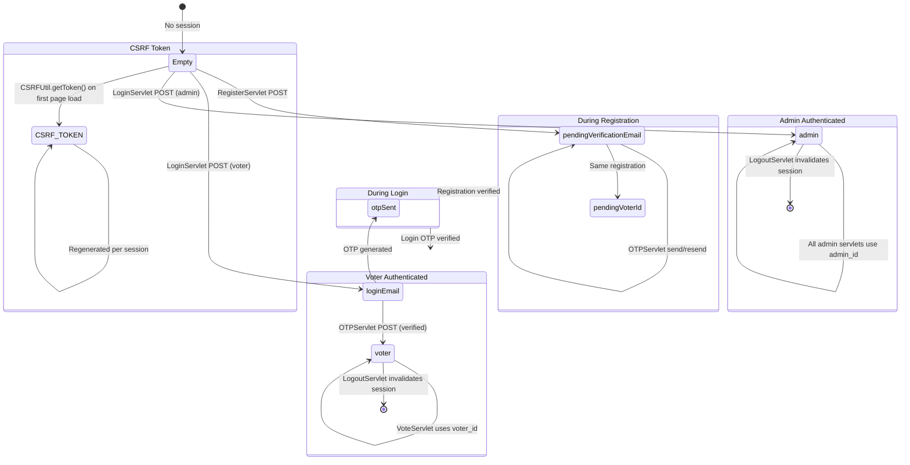
```mermaid
stateDiagram-v2
    [*] --> Empty: No session

    state "During Registration" as REG {
        Empty --> pendingVerificationEmail: RegisterServlet POST
        pendingVerificationEmail --> pendingVerificationEmail: OTPServlet send/resend
        pendingVerificationEmail --> pendingVoterId: Same registration
    }

    state "During Login" as LOGIN {
        Empty --> loginEmail: LoginServlet POST (voter)
        loginEmail --> otpSent: OTP generated
    }

    state "Voter Authenticated" as VAUTH {
        loginEmail --> voter: OTPServlet POST (verified)
        voter --> voter: VoteServlet uses voter_id
        voter --> [*]: LogoutServlet invalidates session
    }

    state "Admin Authenticated" as AAUTH {
        Empty --> admin: LoginServlet POST (admin)
        admin --> admin: All admin servlets use admin_id
        admin --> [*]: LogoutServlet invalidates session
    }

    state "CSRF Token" as CSRF {
        Empty --> CSRF_TOKEN: CSRFUtil.getToken() on first page load
        CSRF_TOKEN --> CSRF_TOKEN: Regenerated per session
    }

    REG --> LOGIN: Registration verified
    LOGIN --> VAUTH: Login OTP verified
```

---

## 9. API & Servlet Mapping Reference

### 9.1 URL Routing Table

| URL Pattern | Servlet | HTTP Methods | Access Level | Description |
|---|---|---|---|---|
| `/` | `index.jsp` (welcome file) | GET | Public | Landing page |
| `/register` | `RegisterServlet` | GET, POST | Public | Voter registration |
| `/login` | `LoginServlet` | GET, POST | Public | Voter/Admin login |
| `/otp` | `OTPServlet` | GET, POST | Public | OTP send/resend/verify |
| `/logout` | `LogoutServlet` | GET | Any authenticated | Session destroy |
| `/results` | `ResultServlet` | GET | Public | Election results |
| `/verify-receipt` | `VerifyReceiptServlet` | GET, POST | Public | Receipt audit trail |
| `/voter/vote` | `VoteServlet` | GET, POST | Voter only | Ballot + vote casting |
| `/admin/dashboard` | `AdminDashboardServlet` | GET | Admin only | Stats dashboard |
| `/admin/elections` | `AdminElectionServlet` | GET, POST | Admin only | Election CRUD |
| `/admin/candidates` | `AdminCandidateServlet` | GET, POST | Admin only | Candidate CRUD |
| `/admin/voters` | `AdminVoterApprovalServlet` | GET, POST | Admin only | Voter approval |
| `/admin/results` | `AdminResultServlet` | GET, POST | Admin only | View/declare results |
| `/admin/export` | `ExportResultServlet` | GET | Admin only | CSV/HTML export |

### 9.2 Filter Chain Configuration

| Filter | URL Pattern | Order | Purpose |
|---|---|---|---|
| `CSRFFilter` | `/*` | 1st | CSRF validation + security headers |
| `AuthFilter` | `/voter/*` | 2nd | Check `session.getAttribute("voter")` |
| `AdminAuthFilter` | `/admin/*` | 2nd | Check `session.getAttribute("admin")` |

### 9.3 JSP View Locations

| JSP | Path | Rendered By |
|---|---|---|
| Landing page | `src/main/webapp/index.jsp` | Welcome file |
| Login form | `WEB-INF/jsp/login.jsp` | LoginServlet |
| Registration form | `WEB-INF/jsp/register.jsp` | RegisterServlet |
| OTP verification | `WEB-INF/jsp/verify-otp.jsp` | OTPServlet |
| Vote success | `WEB-INF/jsp/vote-success.jsp` | VoteServlet |
| Ballot page | `WEB-INF/jsp/ballot.jsp` | VoteServlet |
| Public results | `WEB-INF/jsp/results.jsp` | ResultServlet |
| Receipt verification | `WEB-INF/jsp/verify-receipt.jsp` | VerifyReceiptServlet |
| Admin dashboard | `WEB-INF/jsp/admin/dashboard.jsp` | AdminDashboardServlet |
| Election management | `WEB-INF/jsp/admin/elections.jsp` | AdminElectionServlet |
| Candidate management | `WEB-INF/jsp/admin/candidates.jsp` | AdminCandidateServlet |
| Voter approval | `WEB-INF/jsp/admin/voters.jsp` | AdminVoterApprovalServlet |
| Admin results | `WEB-INF/jsp/admin/results.jsp` | AdminResultServlet |
| Error page | `WEB-INF/jsp/error.jsp` | Error handler |
| Common header | `WEB-INF/jsp/header.jsp` | Included by all pages |
| Common footer | `WEB-INF/jsp/footer.jsp` | Included by all pages |

---

## 10. Deployment Architecture

### 10.1 Deployment Diagram

```mermaid
graph TB
    subgraph Client
        Browser[Chrome / Firefox / Safari]
    end

    subgraph Application Server
        subgraph "Apache Tomcat 11"
            Connector[HTTP Connector :8080]
            Engine[Catalina Engine]
            Host[localhost Host]
            Context[/e-voting Context]

            subgraph Web Application - e-voting.war
                Filters[Filter Chain]
                Servlets[Servlet Container]
                JSPs[JSP Engine]
                Classes[WEB-INF/classes]
                Libs[WEB-INF/lib]
            end
        end
    end

    subgraph Database Server
        MySQL[MySQL 8.0+<br/>Port 3306<br/>Database: e_voting]
    end

    subgraph External Service
        SMTP[SMTP Server<br/>smtp.gmail.com:587]
    end

    Browser -->|HTTP :8080| Connector
    Connector --> Engine
    Engine --> Host
    Host --> Context
    Context --> Filters
    Filters --> Servlets
    Servlets --> JSPs
    Servlets --> Classes
    Classes --> Libs
    Classes -->|JDBC :3306| MySQL
    Classes -->|SMTP :587| SMTP
```

### 10.2 Build & Deploy Pipeline

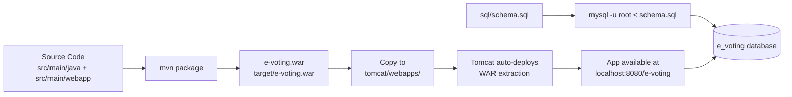
```mermaid
graph LR
    SRC[Source Code<br/>src/main/java + src/main/webapp] --> MVN[mvn package]
    MVN --> WAR[e-voting.war<br/>target/e-voting.war]
    WAR --> COPY[Copy to<br/>tomcat/webapps/]
    COPY --> TOMCAT[Tomcat auto-deploys<br/>WAR extraction]
    TOMCAT --> APP[App available at<br/>localhost:8080/e-voting]
    SQL[sql/schema.sql] --> MYSQL[mysql -u root < schema.sql]
    MYSQL --> DB[(e_voting database)]
    APP --> DB
```

### 10.3 WAR File Structure

```
e-voting.war
├── META-INF/
│   └── MANIFEST.MF
├── WEB-INF/
│   ├── classes/
│   │   ├── com/evoting/
│   │   │   ├── dao/          (6 DAO classes)
│   │   │   ├── filter/       (3 filter classes)
│   │   │   ├── model/        (6 model classes)
│   │   │   ├── servlet/      (13 servlet classes)
│   │   │   └── util/         (5 utility classes)
│   │   └── app.properties
│   ├── lib/                  (all Maven dependencies)
│   ├── jsp/
│   │   ├── admin/            (5 admin JSPs)
│   │   ├── ballot.jsp
│   │   ├── error.jsp
│   │   ├── footer.jsp
│   │   ├── header.jsp
│   │   ├── login.jsp
│   │   ├── register.jsp
│   │   ├── results.jsp
│   │   ├── verify-otp.jsp
│   │   ├── verify-receipt.jsp
│   │   └── vote-success.jsp
│   └── web.xml
├── css/
│   └── style.css
└── index.jsp
```

### 10.4 Configuration Reference

| File | Location | Purpose |
|---|---|---|
| `pom.xml` | Project root | Maven dependencies and build config |
| `web.xml` | `WEB-INF/web.xml` | Servlet mappings, filters, session config |
| `app.properties` | `src/main/resources/app.properties` | DB credentials, SMTP config, pool size |
| `schema.sql` | `sql/schema.sql` | Database DDL + seed data |
| `style.css` | `src/main/webapp/css/style.css` | Custom CSS overrides |
